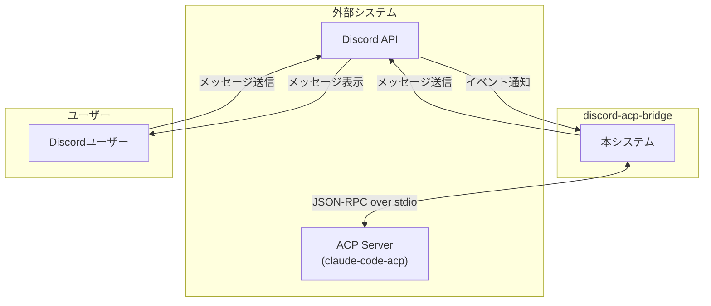
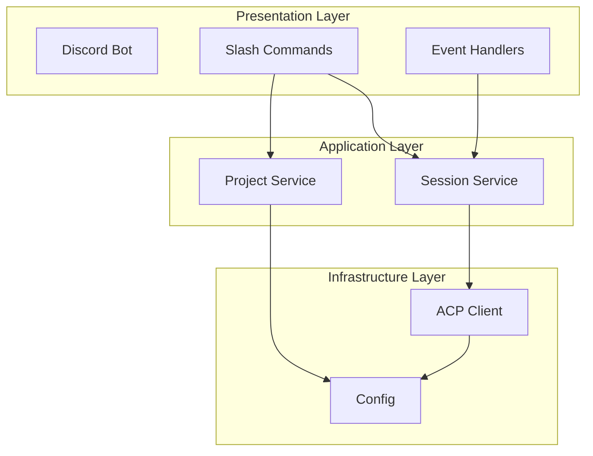
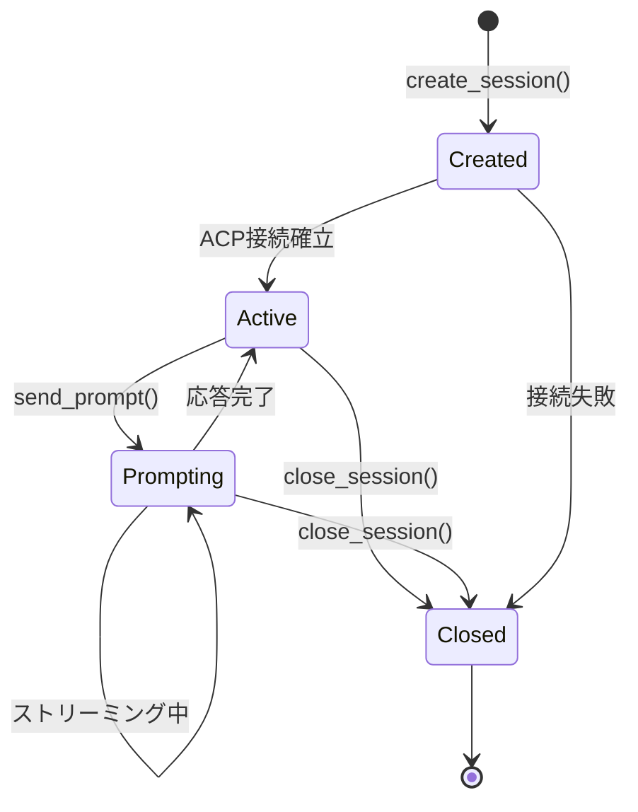
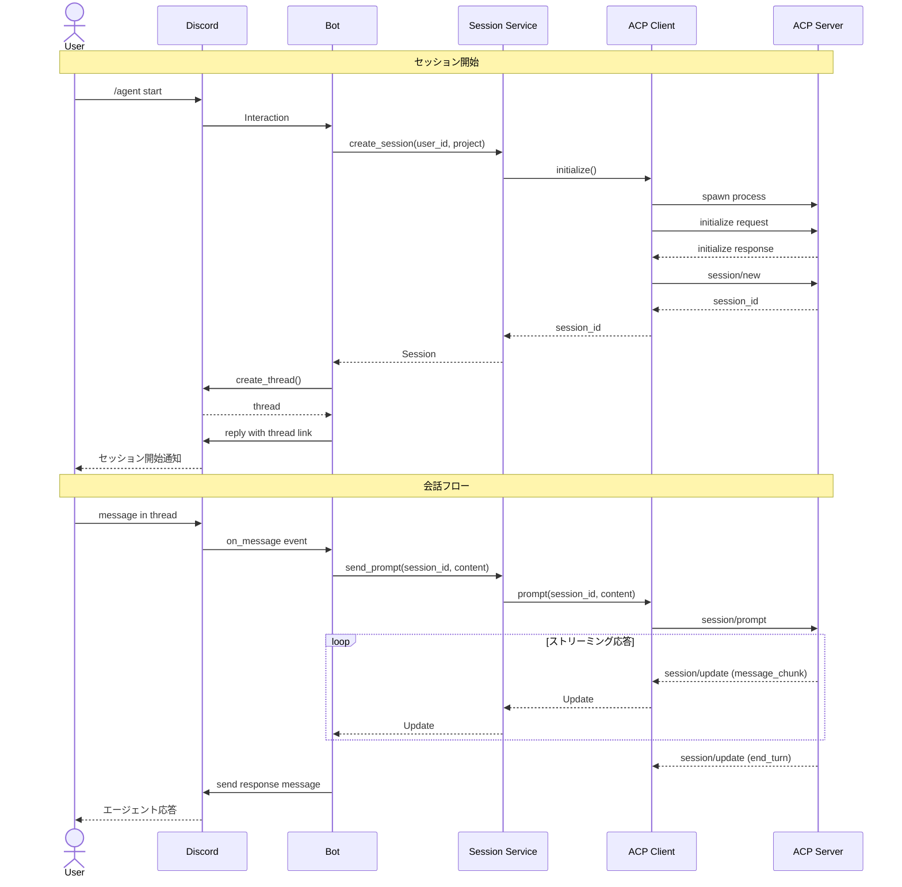

# discord-acp-bridge 設計仕様書

| 項目 | 内容 |
|------|------|
| Version | 1.0 |
| Date | 2026-02-03 |
| Status | Draft |

---

## 1. はじめに

### 1.1 目的

本文書は discord-acp-bridge の設計仕様を定義する。本文書により、開発者・レビュアーが実装前にシステムの振る舞いを理解し、合意形成を行うことを目的とする。

### 1.2 スコープ

本文書は以下を対象とする：

- システム全体のアーキテクチャ
- 各コンポーネントの責務と振る舞い
- 外部インターフェース仕様
- データモデル
- 状態遷移

以下は対象外とする：

- 実装コード
- テスト仕様
- 運用手順

### 1.3 用語定義

| 用語 | 定義 |
|------|------|
| ACP | Agent Client Protocol。エディタとAIエージェント間の通信を標準化するプロトコル |
| ACP Server | ACPプロトコルを実装したエージェント（例: claude-code-acp） |
| ACP Client | ACPプロトコルでエージェントと通信するクライアント。本システムがこれに該当 |
| Session | ユーザーとエージェント間の一連の対話。プロジェクトに紐づく |
| Project | エージェントが操作対象とするファイルシステム上のディレクトリ |
| Prompt | ユーザーからエージェントへの入力メッセージ |
| Turn | 1回のPromptとそれに対するエージェントの応答のセット |

### 1.4 参照文書

| 文書 | URL |
|------|-----|
| Agent Client Protocol 仕様 | https://agentclientprotocol.com/ |
| discord.py ドキュメント | https://discordpy.readthedocs.io/ |
| ADR | ./ADR.md |
| 提案書 | ./Proposal.md |

---

## 2. システム概要

### 2.1 システムコンテキスト



### 2.2 システム境界

| 境界 | 本システムの責務 | 外部の責務 |
|------|------------------|------------|
| Discord API | Gateway接続維持、コマンド処理、メッセージ整形 | 認証、メッセージ配信、スレッド管理 |
| ACP Server | プロトコルに従った通信、セッション管理 | コード生成、ファイル操作、ツール実行 |

### 2.3 前提条件

| ID | 前提条件 |
|----|----------|
| A-1 | ACP Serverは事前にインストールされ、コマンドラインから起動可能である |
| A-2 | Discord Bot Tokenは事前に取得済みである |
| A-3 | ユーザーはDiscordサーバーにアクセス可能である |
| A-4 | プロジェクトディレクトリはローカルファイルシステム上に存在する |

### 2.4 制約事項

| ID | 制約 | 理由 |
|----|------|------|
| C-1 | ACP通信はstdio経由のみ | MVP段階ではローカル実行を優先 |
| C-2 | 許可されたユーザーのみ利用可能 | 個人サーバー運用前提、セキュリティ確保 |
| C-3 | 同時アクティブセッションは1つ | 単一ユーザー運用のため |
| C-4 | Discordメッセージは2000文字制限 | Discord API制約 |

---

## 3. 機能要件

### 3.1 機能一覧

| ID | 機能名 | 概要 | 優先度 |
|----|--------|------|--------|
| F-1 | プロジェクト一覧表示 | 登録済みプロジェクトを一覧表示する | Must |
| F-2 | プロジェクト切り替え | 操作対象プロジェクトを変更する | Must |
| F-3 | プロジェクト登録 | 新規プロジェクトを登録する | Should |
| F-4 | セッション開始 | エージェントとの対話セッションを開始する | Must |
| F-5 | セッション終了 | 対話セッションを正常終了する | Must |
| F-6 | セッション強制終了 | 対話セッションを強制終了する | Must |
| F-7 | セッション状態表示 | 現在のセッション状態を確認する | Should |
| F-8 | メッセージ送信 | エージェントにメッセージを送信する | Must |
| F-9 | 応答受信 | エージェントからの応答を受信・表示する | Must |
| F-10 | 無応答タイムアウト | 30分無応答時に自動強制終了する | Must |

### 3.2 ユースケース

#### UC-1: プロジェクトを選択してセッションを開始する

| 項目 | 内容 |
|------|------|
| アクター | Discordユーザー |
| 事前条件 | ユーザーがDiscordサーバーに参加している |
| 事後条件 | セッションが開始され、専用スレッドが作成される |

**基本フロー:**

1. ユーザーが `/projects` を実行する
2. システムが登録済みプロジェクト一覧（ID、パス）を表示する
3. ユーザーが `/agent start project_id:<id>` を実行する
4. システムがACP Serverを起動し、セッションを確立する
5. システムがDiscord上に専用スレッドを作成する
6. システムがスレッドURLをユーザーに通知する

**代替フロー:**

- 3a. 指定IDのプロジェクトが存在しない場合
  - システムがエラーメッセージを表示する
  - フローは終了する
- 4a. ACP Server起動に失敗した場合
  - システムがエラーメッセージを表示する
  - フローは終了する

#### UC-2: エージェントと対話する

| 項目 | 内容 |
|------|------|
| アクター | Discordユーザー |
| 事前条件 | セッションが開始されている |
| 事後条件 | エージェントの応答がスレッドに表示される |

**基本フロー:**

1. ユーザーがセッションスレッドにメッセージを投稿する
2. システムがメッセージをACP Serverに送信する
3. ACP Serverがストリーミングで応答を返す
4. システムが応答をDiscordメッセージとして整形・表示する

**代替フロー:**

- 1a. Bot以外からの投稿でない場合
  - システムは処理をスキップする
- 3a. 応答が2000文字を超える場合
  - システムがメッセージを分割して送信する
- 3b. エージェントがツールを実行する場合
  - システムが実行中のツール名を一時表示する

#### UC-3: セッションを終了する

| 項目 | 内容 |
|------|------|
| アクター | Discordユーザー |
| 事前条件 | アクティブなセッションが存在する |
| 事後条件 | セッションが終了し、ACP Serverが停止する |

**基本フロー:**

1. ユーザーが `/agent stop` を実行する
2. システムがACP Serverにキャンセル要求を送信する
3. システムがACP Serverプロセスを終了する
4. システムがセッション終了をユーザーに通知する

---

## 4. 外部インターフェース

### 4.1 Discord Slash Commands

#### 4.1.1 /projects

| 項目 | 内容 |
|------|------|
| 説明 | 登録済みプロジェクト一覧を表示する |
| 引数 | なし |
| 応答 | ID、パスの一覧（Embed形式） |
| 権限 | 許可ユーザーのみ（それ以外は無視） |
| エラー | プロジェクト未登録時は「登録されているプロジェクトはありません」 |
| 備考 | プロジェクトIDは自動スキャン結果のパス名順に割り当てられる（1から連番） |

**応答例:**
```
1: /home/user/projects/api
2: /home/user/projects/web
3: /home/user/projects/cli
```

#### 4.1.2 /project add

| 項目 | 内容 |
|------|------|
| 説明 | 新規プロジェクトを登録する |
| 引数 | `path` (string, required): ディレクトリパス |
| 応答 | 「プロジェクト #{id} を登録しました（{path}）」 |
| 権限 | 許可ユーザーのみ（それ以外は無視） |
| エラー | パスが存在しない場合は「指定されたパスが存在しません」 |
| 備考 | IDは登録順に1から自動採番される |

#### 4.1.3 /agent start

| 項目 | 内容 |
|------|------|
| 説明 | エージェントセッションを開始する |
| 引数 | `project_id` (integer, required): プロジェクトID |
| 応答 | スレッドリンクを含む開始通知 |
| 権限 | 許可ユーザーのみ（それ以外は無視） |
| エラー | 存在しないID指定時は「プロジェクト #{id} が見つかりません」<br/>ACP Server起動失敗時は「エージェントの起動に失敗しました」 |
| 備考 | プロジェクトIDは `/projects` で確認できる |

#### 4.1.4 /agent stop

| 項目 | 内容 |
|------|------|
| 説明 | エージェントセッションを正常終了する |
| 引数 | なし |
| 応答 | 「セッションを終了しました」 |
| 権限 | 許可ユーザーのみ（それ以外は無視） |
| エラー | アクティブセッションなしの場合は「アクティブなセッションはありません」 |
| 備考 | ACPプロトコルに従いsession/cancelを送信後、プロセス終了を待機 |

#### 4.1.5 /agent kill

| 項目 | 内容 |
|------|------|
| 説明 | エージェントセッションを強制終了する |
| 引数 | なし |
| 応答 | 「セッションを強制終了しました」 |
| 権限 | 許可ユーザーのみ（それ以外は無視） |
| エラー | アクティブセッションなしの場合は「アクティブなセッションはありません」 |
| 備考 | ACPプロセスをSIGKILLで即座に終了。応答なし・ハング時に使用 |

#### 4.1.6 /agent status

| 項目 | 内容 |
|------|------|
| 説明 | 現在のセッション状態を表示する |
| 引数 | なし |
| 応答 | セッションID、プロジェクトID、モデルID、状態、最終応答からの経過時間（Embed形式） |
| 権限 | 許可ユーザーのみ（それ以外は無視） |
| エラー | アクティブセッションなしの場合は「アクティブなセッションはありません」 |

#### 4.1.7 /agent model

| 項目 | 内容 |
|------|------|
| 説明 | セッションのモデルを切り替える |
| 引数 | `model_id` (string, required): モデルID |
| 応答 | 「モデルを {model_id} に変更しました」 |
| 権限 | 許可ユーザーのみ（それ以外は無視） |
| エラー | アクティブセッションなしの場合は「アクティブなセッションはありません」<br/>無効なモデルID指定時は「指定されたモデルIDは利用できません」 |
| 備考 | オートコンプリート機能で利用可能なモデル一覧を表示 |

#### 4.1.8 /agent usage

| 項目 | 内容 |
|------|------|
| 説明 | セッションの使用量情報を表示する |
| 引数 | なし |
| 応答 | コンテキスト使用量、累積コスト（Embed形式） |
| 権限 | 許可ユーザーのみ（それ以外は無視） |
| エラー | アクティブセッションなしの場合は「アクティブなセッションはありません」 |
| 備考 | ACP Serverから取得したLLM使用量情報を表示 |

### 4.2 スレッド内メッセージ

| 項目 | 内容 |
|------|------|
| トリガー | セッションに紐づくスレッドへのメッセージ投稿 |
| 処理条件 | 投稿者がBotでないこと、かつ許可ユーザーであること |
| 動作 | メッセージ内容をエージェントに送信し、応答を同スレッドに投稿 |
| 応答形式 | Markdown形式のテキスト。2000文字超過時は分割 |
| タイピング表示 | 応答待機中は「入力中...」を表示 |

### 4.3 ACP通信インターフェース

#### 4.3.1 初期化

| 項目 | 内容 |
|------|------|
| メソッド | `initialize` |
| 方向 | Client → Server |
| 目的 | クライアント情報と機能の通知 |
| 入力 | client_info (name, version), capabilities |
| 出力 | サーバー機能情報 |

#### 4.3.2 セッション作成

| 項目 | 内容 |
|------|------|
| メソッド | `session/new` |
| 方向 | Client → Server |
| 目的 | 新規セッションの確立 |
| 入力 | working_directory: プロジェクトパス |
| 出力 | session_id: セッション識別子 |

#### 4.3.3 プロンプト送信

| 項目 | 内容 |
|------|------|
| メソッド | `session/prompt` |
| 方向 | Client → Server |
| 目的 | ユーザー入力の送信 |
| 入力 | session_id, content (テキスト) |
| 出力 | なし（ストリーミング通知で応答） |

#### 4.3.4 セッション更新（通知）

| 項目 | 内容 |
|------|------|
| メソッド | `session/update` |
| 方向 | Server → Client |
| 目的 | 応答のストリーミング配信 |
| 内容 | update_type, content |

**update_type一覧:**

| type | 内容 | contentの構造 |
|------|------|---------------|
| message_chunk | テキスト応答の断片 | `{role, text}` |
| tool_call | ツール実行通知 | `{tool_call_id, name, status, input}` |
| end_turn | ターン終了 | `{stop_reason}` |

#### 4.3.5 セッションキャンセル

| 項目 | 内容 |
|------|------|
| メソッド | `session/cancel` |
| 方向 | Client → Server |
| 目的 | セッションの終了要求 |
| 入力 | session_id |
| 出力 | なし |

---

## 5. 内部構造

### 5.1 コンポーネント構成



### 5.2 コンポーネント責務

| コンポーネント | 責務 | 依存先 |
|---------------|------|--------|
| Discord Bot | Gateway接続、イベントディスパッチ | discord.py |
| Slash Commands | コマンド受付、入力検証、応答整形 | Session Service, Project Service |
| Event Handlers | メッセージイベント処理 | Session Service |
| Session Service | セッションライフサイクル管理、プロンプト送受信 | ACP Client |
| Project Service | プロジェクト登録・取得・切り替え | Config |
| ACP Client | ACPプロトコル通信、プロセス管理 | Config |
| Config | 設定値の読み込み・提供 | 環境変数, .env |

### 5.3 Session Service 仕様

#### 操作一覧

| 操作 | 入力 | 出力 | 事前条件 | 事後条件 |
|------|------|------|----------|----------|
| create_session | user_id, project | Session | projectが有効 | セッションが作成され、ACP接続が確立、Watchdog開始 |
| send_prompt | session_id, content | AsyncIterator[Update] | セッションがActive状態 | プロンプトが送信され、応答をストリーミング |
| get_active_session | user_id | Session or None | なし | なし |
| get_session_by_thread | thread_id | Session or None | なし | なし |
| close_session | session_id | None | セッションが存在 | セッションがClosed、ACP接続が正常切断 |
| kill_session | session_id | None | セッションが存在 | セッションがClosed、ACPプロセスが強制終了 |

#### エラー条件

| 条件 | 例外 |
|------|------|
| 存在しないsession_idを指定 | SessionNotFoundError |
| Closed状態のセッションにprompt | SessionStateError |
| ACP Server接続失敗 | ACPConnectionError |
| ACP Server応答タイムアウト | ACPTimeoutError |

### 5.4 Project Service 仕様

#### 操作一覧

| 操作 | 入力 | 出力 | 事前条件 | 事後条件 |
|------|------|------|----------|----------|
| list_projects | なし | List[Project] | なし | なし |
| get_active_project | なし | Project or None | なし | なし |
| switch_project | project_id | Project | プロジェクトが存在 | 指定プロジェクトがアクティブ |
| add_project | path | Project | pathが存在するディレクトリ | プロジェクトが登録され、IDが自動採番 |

#### エラー条件

| 条件 | 例外 |
|------|------|
| 存在しないプロジェクトIDを指定 | ProjectNotFoundError |
| 存在しないパスを指定 | ValueError |

### 5.5 ACP Client 仕様

#### 操作一覧

| 操作 | 入力 | 出力 | 事前条件 | 事後条件 |
|------|------|------|----------|----------|
| initialize | なし | ServerInfo | なし | プロセスが起動し、初期化完了 |
| create_session | working_directory | session_id | initialize済み | ACPセッションが作成される |
| prompt | session_id, content | AsyncIterator[Update] | セッションが存在 | プロンプトが送信される |
| cancel | session_id | None | セッションが存在 | セッションがキャンセルされる |
| close | なし | None | なし | プロセスが正常終了する |
| kill | なし | None | なし | プロセスがSIGKILLで強制終了する |

#### タイムアウト仕様（Watchdog Timer）

| 項目 | 値 | 説明 |
|------|-----|------|
| 最大無応答時間 | 30分 | session/update通知が30分間ない場合、プロセスを自動kill |
| タイマーリセット | 各update受信時 | ストリーミング中はupdate毎にリセット |
| 自動kill時の通知 | スレッドに通知 | 「エージェントが応答しないため、セッションを強制終了しました」 |

---

## 6. データモデル

### 6.1 エンティティ定義

#### Session

| 属性 | 型 | 説明 | 制約 |
|------|-----|------|------|
| id | string | セッション識別子 | UUID形式、一意 |
| user_id | integer | Discordユーザー ID | 正の整数 |
| project | Project | 紐づくプロジェクト | Not Null |
| state | SessionState | 現在の状態 | Enum値 |
| thread_id | integer or null | DiscordスレッドID | 正の整数 or null |
| acp_session_id | string or null | ACPセッションID | 初期化後はNot Null |
| created_at | datetime | 作成日時 | 自動設定 |
| last_activity_at | datetime | 最終応答日時 | update受信毎に更新 |

#### Project

| 属性 | 型 | 説明 | 制約 |
|------|-----|------|------|
| id | integer | プロジェクトID | 1から連番、一意 |
| path | string | ディレクトリパス | 存在するパス |
| is_active | boolean | アクティブ状態 | デフォルト false |

### 6.2 状態定義

#### SessionState



| 状態 | 説明 | 許可される操作 |
|------|------|---------------|
| Created | セッション作成直後 | close_session |
| Active | 対話可能状態 | send_prompt, close_session |
| Prompting | 応答待機中 | close_session |
| Closed | 終了済み | なし |

---

## 7. 設定仕様

### 7.1 設定項目

| キー | 型 | 必須 | デフォルト | 説明 |
|------|-----|------|-----------|------|
| DISCORD_BOT_TOKEN | string | Yes | - | Discord Bot Token |
| DISCORD_GUILD_ID | integer | Yes | - | 開発用ギルドID（指定時はそのギルドのみにコマンド同期） |
| DISCORD_ALLOWED_USER_ID | integer | Yes | - | 利用を許可するDiscordユーザーID |
| AGENT_COMMAND | list[string] | No | ["claude-code-acp"] | ACP Server起動コマンド |

### 7.2 PROJECTS形式

```json
[
  "/home/user/projects/api",
  "/home/user/projects/web",
  "/home/user/projects/cli"
]
```

配列のインデックス順にID 1, 2, 3... が割り当てられる。

---

## 8. エラー処理

### 8.1 エラー分類

| カテゴリ | 例 | ユーザーへの通知 | 内部処理 |
|----------|-----|-----------------|----------|
| 認証エラー | 許可されていないユーザーからの操作 | 通知しない（無視） | ログ記録（WARN） |
| 入力エラー | 存在しないプロジェクト指定 | 具体的なエラーメッセージ | ログ記録（INFO） |
| 状態エラー | 未選択でセッション開始 | 操作手順の案内 | ログ記録（WARN） |
| 接続エラー | ACP Server起動失敗 | 汎用エラーメッセージ | ログ記録（ERROR）、リトライなし |
| 内部エラー | 予期しない例外 | 「エラーが発生しました」 | ログ記録（ERROR）、スタックトレース |

### 8.2 リトライポリシー

| 対象 | リトライ | 回数 | 間隔 |
|------|----------|------|------|
| Discord API | Yes | 3回 | Exponential backoff（discord.py標準） |
| ACP通信 | No | - | - |

---

## 9. 非機能要件

### 9.1 パフォーマンス

| 指標 | 目標値 | 測定方法 |
|------|--------|----------|
| コマンド応答時間（ACK） | 3秒以内 | Discordタイムアウト制約 |
| ストリーミング開始 | 5秒以内 | 初回chunk受信まで |
| 同時セッション数 | 10以上 | 負荷テスト |

### 9.2 可用性

| 項目 | 要件 |
|------|------|
| 自動再起動 | プロセス異常終了時にsystemd/supervisorで再起動 |
| ヘルスチェック | `/agent status` で状態確認可能 |
| グレースフルシャットダウン | SIGTERM受信時にセッションをクローズ |

### 9.3 セキュリティ

| 項目 | 対策 |
|------|------|
| 認証情報管理 | Bot Tokenは環境変数で管理、.gitignoreに.envを追加 |
| ユーザー制限 | ALLOWED_USER_IDに一致するユーザーのみ操作可能 |
| パス制限 | 登録済みプロジェクトパスのみアクセス許可 |
| 不正アクセス | 許可外ユーザーからの操作は無視（応答しない） |

---

## 10. 未決定事項

| ID | 項目 | 選択肢 | 決定期限 |
|----|------|--------|----------|
| TBD-1 | セッション履歴の永続化 | メモリのみ / DB保存 | MVP後 |
| TBD-2 | ファイル添付の扱い | 無視 / エージェントに転送 | MVP後 |

---

## 11. 成功指標

| 指標 | 目標 | 測定方法 |
|------|------|----------|
| MVP完成 | 基本フロー（UC-1, UC-2, UC-3）が動作 | 手動テスト |
| 応答品質 | エージェント応答がDiscord上で正しく表示される | 手動確認 |
| エラー率 | 内部エラー発生率 < 1% | ログ集計 |

---

## Appendix A: メッセージ整形ルール

### A.1 長文分割

| 条件 | 処理 |
|------|------|
| 2000文字以下 | そのまま送信 |
| 2000文字超過 | 改行位置で分割し、複数メッセージとして送信 |
| コードブロック内 | ブロックを壊さないよう分割位置を調整 |

### A.2 Markdown変換

| ACP形式 | Discord表示 |
|---------|-------------|
| テキスト | そのまま表示（Markdown解釈） |
| コードブロック | ```で囲んで表示 |
| ツール実行中 | 「🔧 {tool_name} を実行中...」を一時表示（5秒後削除） |

---

## Appendix B: シーケンス図

### B.1 セッション開始〜会話フロー


