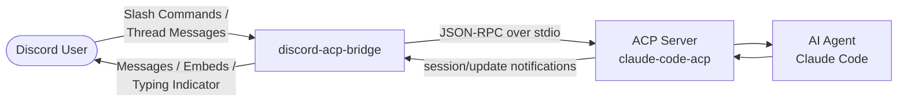
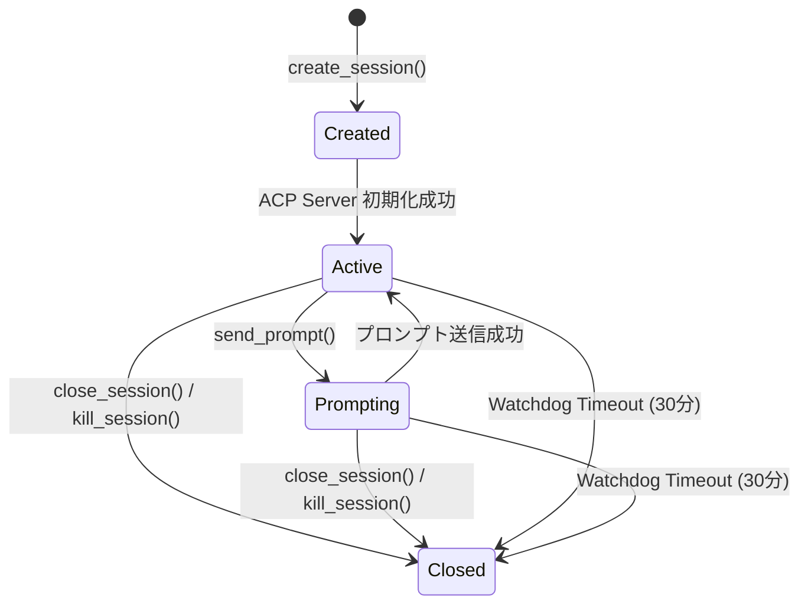
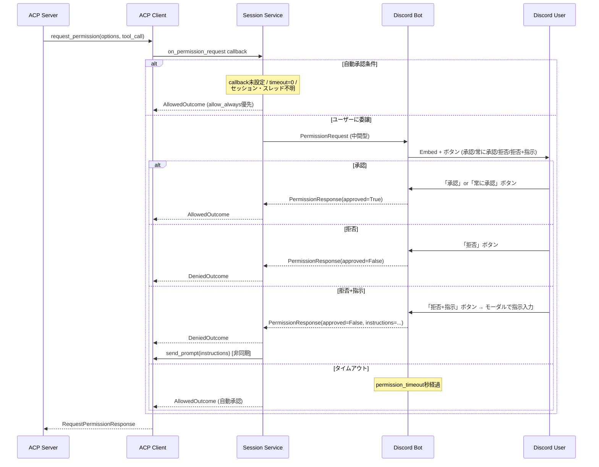
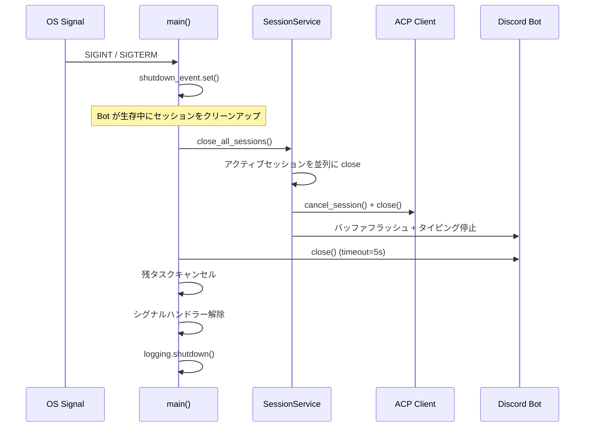
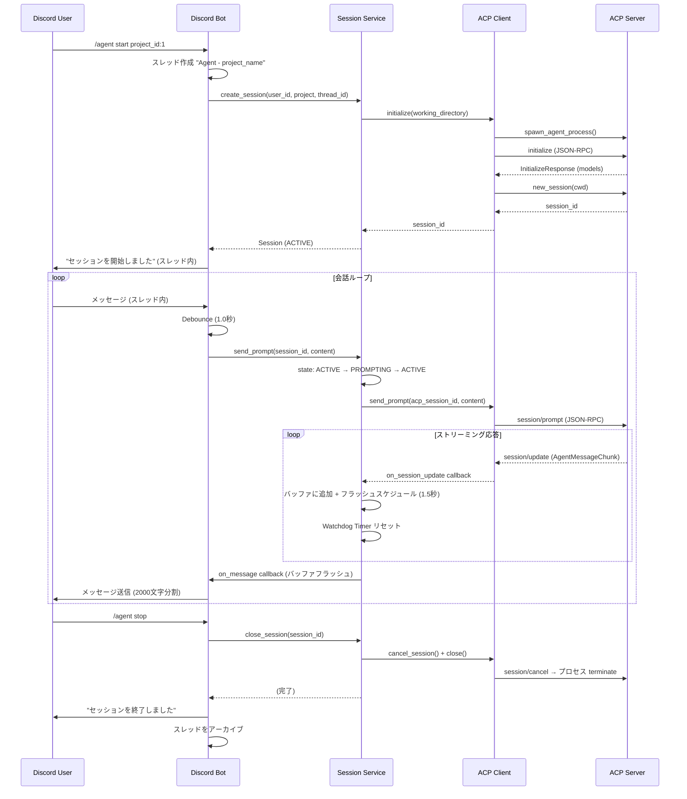

# Architecture Document

## 1. 概要

Discord Gateway Bot として常駐し、ユーザーからのメッセージをトリガーに **Agent Client Protocol (ACP)** を通じて AI エージェント（Claude Code 等）と対話できるようにするアプリケーション。

### 提供価値

- Discord からシームレスに AI エージェントと対話できる
- モバイルからでもエージェントを操作できる

### システムコンテキスト図



## 2. 技術選定

| 技術 | 採用 | 備考 |
|------|------|------|
| 言語 | Python 3.12+ | 開発は 3.14 で実施 |
| パッケージマネージャ | uv | uv.lock で依存管理 |
| Discord ライブラリ | discord.py v2.x | async/await ベース |
| ACP SDK | agent-client-protocol (PyPI) | Pydantic モデルによるスキーマ検証 |
| バリデーション | Pydantic v2.x / pydantic-settings | 設定管理にも使用 |
| 構造化ログ | structlog | JSON 形式、3 出力先 |
| リンター/フォーマッター | Ruff | |
| 型チェック | mypy | |
| テスト | pytest / pytest-asyncio | |

### ADR-001: Python + discord.py を採用

ACP 公式 SDK が提供されている言語（TypeScript, Python, Rust, Kotlin）から選定。Python を選択した理由:

- ACP Python SDK が Pydantic による自動バリデーションを提供
- discord.py v2.x が安定しており asyncio との統合が自然
- 動的型付けによる高速なプロトタイピング + mypy で必要に応じた静的解析
- AI エコシステムとの将来的な連携を視野に入れられる

### ADR-003: プロジェクト切り替え機能の廃止

当初 `/project switch` でアクティブプロジェクトを設定し `/agent start` で使用する設計だったが、以下の理由で廃止:

- `/agent start` に `project_id` を必須化し、ステートレスな設計に変更
- 明示的なプロジェクト指定により誤操作を防止
- オートコンプリート機能で入力負荷を軽減

## 3. アーキテクチャ

### ADR-002: 3 層レイヤードアーキテクチャ

```
┌─────────────────────────────────────────────────────────┐
│                  Presentation Layer                      │
│         (Discord Bot / Commands / Events / Views)        │
└────────────────────────┬────────────────────────────────┘
                         │
┌────────────────────────▼────────────────────────────────┐
│                  Application Layer                       │
│         (Session Service / Project Service)               │
└────────────────────────┬────────────────────────────────┘
                         │
┌────────────────────────▼────────────────────────────────┐
│                 Infrastructure Layer                     │
│            (ACP Client / Config / Logging)               │
└─────────────────────────────────────────────────────────┘
```

### コンポーネント

| コンポーネント | ファイル | 責務 |
|---------------|---------|------|
| ACPBot | `presentation/bot.py` | Gateway 接続、イベントディスパッチ、メッセージ送信 |
| Agent Commands | `presentation/commands/agent.py` | `/agent` コマンド群（start, stop, kill, status, model, usage） |
| Project Commands | `presentation/commands/project.py` | `/projects` コマンド群（list, new） |
| Message Handler | `presentation/events/message.py` | スレッド内メッセージの受信と Debounce 処理 |
| Permission View | `presentation/views/permission.py` | パーミッション要求の Embed + ボタン UI |
| Session Service | `application/session.py` | セッションライフサイクル管理、プロンプト送受信、バッファリング |
| Project Service | `application/project.py` | プロジェクト自動スキャン、取得、作成 |
| Data Models | `application/models.py` | 層間通信用データクラス（PermissionRequest/Response） |
| ACP Client | `infrastructure/acp_client.py` | ACP プロトコル通信、プロセス管理、Watchdog Timer |
| Config | `infrastructure/config.py` | Pydantic Settings による設定管理 |
| Logging | `infrastructure/logging.py` | structlog 構造化ログ設定 |
| Main | `main.py` | エントリポイント、Graceful Shutdown |

### プロジェクト構成

```
discord-acp-bridge/
├── src/
│   └── discord_acp_bridge/
│       ├── __init__.py
│       ├── main.py
│       ├── presentation/
│       │   ├── bot.py
│       │   ├── commands/
│       │   │   ├── agent.py
│       │   │   └── project.py
│       │   ├── events/
│       │   │   └── message.py
│       │   └── views/
│       │       └── permission.py
│       ├── application/
│       │   ├── models.py
│       │   ├── session.py
│       │   └── project.py
│       └── infrastructure/
│           ├── acp_client.py
│           ├── config.py
│           └── logging.py
├── tests/
├── pyproject.toml
└── .env
```

## 4. データモデル

### Session

| フィールド | 型 | 説明 |
|-----------|-----|------|
| `id` | `str` | セッション ID（UUID） |
| `user_id` | `int` | Discord ユーザー ID |
| `project` | `Project` | 紐づくプロジェクト |
| `state` | `SessionState` | 現在の状態 |
| `thread_id` | `int \| None` | Discord スレッド ID |
| `acp_session_id` | `str \| None` | ACP セッション ID |
| `created_at` | `datetime` | 作成日時 |
| `last_activity_at` | `datetime` | 最終応答日時 |
| `available_models` | `list[str]` | 利用可能なモデル一覧 |
| `current_model_id` | `str \| None` | 現在のモデル ID |
| `context_used` | `int \| None` | 使用トークン数 |
| `context_size` | `int \| None` | コンテキストサイズ |
| `total_cost` | `float \| None` | 累積コスト |
| `cost_currency` | `str \| None` | 通貨単位 |

### Project

| フィールド | 型 | 説明 |
|-----------|-----|------|
| `id` | `int` | プロジェクト ID（1 から連番、パス名順） |
| `path` | `str` | ディレクトリの絶対パス |

### SessionState 状態遷移図



| 状態 | 値 | 説明 |
|------|-----|------|
| Created | `"created"` | セッション作成済み（ACP 初期化前） |
| Active | `"active"` | アクティブ（対話可能） |
| Prompting | `"prompting"` | プロンプト送信中 |
| Closed | `"closed"` | 終了済み |

## 5. Discord インターフェース

### Slash Commands

#### `/projects` グループ

| コマンド | 説明 | 引数 |
|---------|------|------|
| `/projects list` | 登録済みプロジェクト一覧を表示 | なし |
| `/projects new` | 新規プロジェクトディレクトリを作成 | `name: str` |

#### `/agent` グループ

| コマンド | 説明 | 引数 |
|---------|------|------|
| `/agent start` | セッションを開始（スレッドを自動作成） | `project_id: int`（オートコンプリート対応） |
| `/agent stop` | セッションを正常終了 | なし |
| `/agent kill` | セッションを強制終了 | なし |
| `/agent status` | セッション状態を表示 | なし |
| `/agent model` | モデルを切り替え | `model_id: str`（オートコンプリート対応） |
| `/agent usage` | 使用量情報を表示 | なし |

### スレッド内メッセージ

- `/agent start` 実行時に専用の Discord スレッドを作成（名前: `"Agent - {project_name}"`）
- スレッド内のメッセージは自動的にエージェントに転送される
- 連続メッセージは **Debounce 処理**（1.0 秒）でまとめて送信
- エージェントからの応答は **バッファリング**（1.5 秒）でまとめて Discord に送信
- 2000 文字を超える応答は分割して送信

## 6. ACP 通信

### 通信方式

JSON-RPC over stdio（`acp.transports.StdioTransport`）で ACP Server と通信。

### 主要な ACP メソッド

| メソッド | 方向 | 目的 |
|---------|------|------|
| `initialize` | Client → Server | クライアント情報の通知、モデル情報の取得 |
| `session/new` | Client → Server | セッションの確立 |
| `session/prompt` | Client → Server | ユーザー入力の送信 |
| `session/update` | Server → Client | 応答のストリーミング配信 |
| `session/cancel` | Client → Server | セッションの終了要求 |
| `set_session_model` | Client → Server | モデルの変更要求 |
| `request_permission` | Server → Client | ツール実行前のパーミッション要求 |

### session/update の通知タイプ

| 型 | 説明 |
|----|------|
| `AgentMessageChunk` | エージェントのテキスト応答（バッファリング後に Discord へ送信） |
| `CurrentModeUpdate` | モデル変更通知（`model_id`, `available_models` を更新） |
| `UsageUpdate` | 使用量更新（`used`, `size`, `cost`）※ ACP SDK 未実装のため独自型定義 |
| `ToolCallStart` / `ToolCallProgress` | ツール実行状況（ログのみ） |
| `AgentThoughtChunk` | エージェントの思考内容（ログのみ） |

### Watchdog Timer

- `session/update` 通知を受信するたびにタイマーをリセット
- **30 分間**無応答の場合、ACP Server プロセスを強制 kill
- kill 時はスレッドにタイムアウト通知を送信し、スレッドをアーカイブ

## 7. パーミッション制御

ACP Server がツール実行時にパーミッションを要求するフローを Discord UI で対話的に処理する。

### フロー



### ボタン UI

| ボタン | 動作 | 優先 option |
|--------|------|-------------|
| 承認 | 1 回承認 | `allow_once` → `allow_always` |
| 常に承認 | 常に承認 | `allow_always` → `allow_once` |
| 拒否 | 拒否 | - |
| 拒否+指示 | モーダル表示 → 指示を入力 → 拒否 + エージェントに指示送信 | - |

## 8. 設定

### 環境変数

`.env` ファイルまたは環境変数で設定。Pydantic Settings で読み込み。

| キー | 型 | 必須 | デフォルト | 説明 |
|------|-----|:---:|-----------|------|
| `DISCORD_BOT_TOKEN` | `str` | Yes | - | Discord Bot Token |
| `DISCORD_GUILD_ID` | `int` | Yes | - | コマンド同期先ギルド ID |
| `DISCORD_ALLOWED_USER_ID` | `int` | Yes | - | 利用を許可するユーザー ID |
| `AGENT_COMMAND` | `list[str]` | No | `["claude-code-acp"]` | ACP Server 起動コマンド（JSON 配列） |
| `TRUSTED_PATHS` | `list[str]` | Yes | `[]` | プロジェクト許可ディレクトリ（JSON 配列） |
| `PERMISSION_TIMEOUT` | `float` | No | `120.0` | パーミッション要求タイムアウト秒（0 で自動承認） |
| `LOG_LEVEL` | `str` | No | `"INFO"` | ログレベル |
| `LOG_DIR` | `str` | No | `"logs"` | ログ出力ディレクトリ |
| `LOG_BACKUP_COUNT` | `int` | No | `7` | ログローテーション保持日数 |

**注意**: `AGENT_COMMAND` と `TRUSTED_PATHS` は JSON 配列形式で指定する（例: `["path1", "path2"]`）。

## 9. エラー処理

| 分類 | 例 | ユーザーへの応答 | ログレベル |
|------|-----|----------------|-----------|
| 認証エラー | 許可外ユーザーの操作 | 応答しない（無視） | WARNING |
| 入力エラー | `ProjectNotFoundError` | 具体的なエラーメッセージ | INFO / WARNING |
| 状態エラー | `SessionStateError` | 操作手順の案内 | WARNING |
| 接続エラー | `ACPConnectionError` | 汎用エラーメッセージ | ERROR |
| 内部エラー | 予期しない例外 | 「エラーが発生しました」 | ERROR + スタックトレース |
| タイムアウト | `ACPTimeoutError` / Watchdog | タイムアウト通知 | ERROR |

## 10. セキュリティ

### ユーザー制限

- `DISCORD_ALLOWED_USER_ID` に一致するユーザーのみコマンド実行・メッセージ送信が可能
- 許可外ユーザーからの操作は無視（応答しない）
- `is_allowed_user()` デコレーターで全 Slash Command に適用

### パス制限

- `TRUSTED_PATHS` で指定されたディレクトリ配下のみアクセス許可
- パストラバーサル防止: プロジェクト名に `/`, `\`, `\0` を含む場合は拒否
- 隠しディレクトリ（`.` で始まる）は自動的に除外
- シンボリックリンク攻撃対策: `resolve()` 後に Trusted Path 検証を実施

### 同時セッション制限

- 1 ユーザーにつき同時アクティブセッションは 1 つのみ

## 11. 構造化ログ

structlog による JSON 形式のログを 3 つの出力先に配信。

| 出力先 | レベル | 説明 |
|--------|--------|------|
| コンソール (stdout) | INFO+ | 運用時の確認用 |
| `logs/latest.log` | DEBUG+ | 全ログ、日次ローテーション |
| `logs/error.log` | WARNING+ | エラー系のみ、日次ローテーション |

ログローテーションは `TimedRotatingFileHandler` で日次実行、`LOG_BACKUP_COUNT` 日分保持。

## 12. Graceful Shutdown

シグナル（`SIGINT`, `SIGTERM`）受信時の終了処理。



**重要**: セッションクリーンアップは Bot が生存中に実行する（Discord への通知が必要なため）。

## 13. シーケンス図: セッション開始〜会話フロー



## 14. 制約事項

| ID | 制約 | 理由 |
|----|------|------|
| C-1 | ACP 通信は stdio 経由のみ | MVP 段階ではローカル実行を優先 |
| C-2 | 許可されたユーザーのみ利用可能 | 個人サーバー運用前提 |
| C-3 | 同時アクティブセッションは 1 つ | 単一ユーザー運用のため |
| C-4 | Discord メッセージは 2000 文字制限 | Discord API 制約 |

### スコープ外

- ACP Server 側の実装
- セッション履歴の永続化
- ファイル添付の扱い
